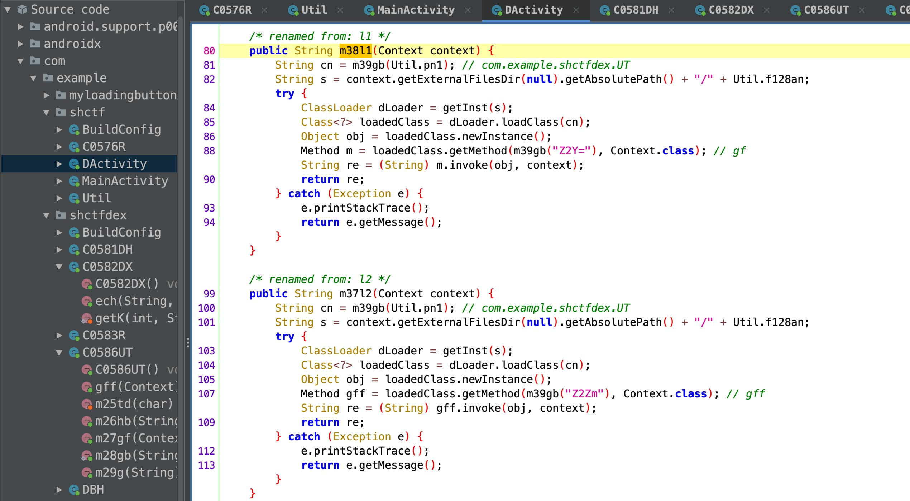
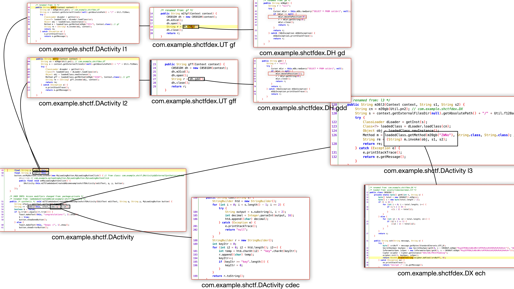

This article offers a writeup for the ASIS CTF Quals 2022's reversing challenge, "Figole" using Frida.

<!--more-->

# Figole

Description:
> This recipe for Figole, by ASIS, is from APK is a Full Android, one of the codebooks created in Android. We'll help you start your own personal codebook! It's easy and fun.

files

- figole.apk
  - links
    - [./figole.apk](./figole.apk)
    - [original (not available)](https://asisctf.com/tasks/figole.apk_2b2eb4b66298cf8b30bf75115796d26fc10bcf27.txz)

## Grok part

TL;DR;

1. Check the `AndroidManifest.xml` file.
2. Check the `com.example.shctf.DActivity` class.
3. Find what method is invoked through `gb` method by hooking it using Frida.
4. Generate a CFG from the findings.

---


### Dynamic Analysis

After I downloaded the APK, I ran the APK to see what it does.

Quick insight from running the app:
A player enters a text and the app checks if the text is correct or not. If the text is wrong, the app shows 'oops'.

Now that we know how the app behaves, we can start to analyze the APK.

### Static Analysis

The first thing I usually check when I'm statically analyzing an APK is the `AndroidManifest.xml` file.  

")

In `com.example.shctf.DActivity`, our input `eText` is being compared with a hardcoded value `rr`. If the input is equal to `rr`, the app prints 'congratulations'. Otherwise, it prints 'oops'.

")


Looking at `com.example.shctf.DActivity` class, I found out that some method is dynamically invoked. I hooked the `gb` method to see what method is invoked through it[^descr].  

[^descr]: `gb` was a simple base64 decode, so I knew that I didn't have to hook it before I actually hooked it. But, I did it anyway.




By hooking the `gb` method, I learned that the method from `com.example.shctfdex.DX` class is invoked.

The method `ech` in `com.example.shctfdex.DX` is using AES to encrypt the text. Since the hardcoded key is also located here, we can now decrypt the encrypted flag.


Now, we can generate a CFG from it for better understanding. 



## Solve part

Now that we **fully** understand the logic, we can write a script to solve it.  For this challenge, I rewrote the whole logic part in Python.

<details>
    <summary>Python code</summary>

```python
import base64

from Crypto.Cipher import AES
from Crypto.Util.Padding import pad


def gb(self, s):
    return base64.b64decode(s).decode('utf-8')


class C0582DX:
    def getK(self, t, s):
        total = C0586UT().g(s)
        c = [None] * (len(total) // 2)
        if t == 0:
            for i in range(0, len(total)):
                if i % 2 == 0:
                    c[i // 2] = total[i]
        else:
            for i2 in range(0, len(total)):
                if i2 % 2 == 1:
                    c[i2 // 2] = total[i2]
        return c

    def ech(self, message: str, s: str):
        # message: input text
        # s: 35733665326331723465357439613672

        srcBuff = message.encode('utf-8')

        # keySpec = self.getK(0, s + self.m28gb("Mzg2OTM3NjEzNDc0MzYzMTM1MzUzMjM2MzMzMjMxMzA="))
        keySpec = self.getK(0, s + '38693761347436313535323633323130')
        ivSpec = self.getK(1, s + '38693761347436313535323633323130')

        keySpec = bytes(''.join(map(chr, keySpec)), 'utf-8')
        ivSpec = bytes(''.join(map(chr, ivSpec)), 'utf-8')
        print("ech:: " + f"{keySpec=}, {ivSpec=}")

        cipher = AES.new(keySpec, AES.MODE_CBC, ivSpec)

        encrypted = cipher.encrypt(pad(srcBuff, AES.block_size))
        return base64.b64encode(encrypted).decode('utf-8')

    def dch(self, message: str, s: str):
        # message: input text
        # s: 35733665326331723465357439613672
        print("dch:: " + f"{message=}, {s=}")

        srcBuff = base64.b64decode(message)

        keySpec = self.getK(0, s + '38693761347436313535323633323130')
        ivSpec = self.getK(1, s + '38693761347436313535323633323130')

        keySpec = bytes(''.join(map(chr, keySpec)), 'utf-8')
        ivSpec = bytes(''.join(map(chr, ivSpec)), 'utf-8')
        print("dch:: " + f"{keySpec=}, {ivSpec=}")

        cipher = AES.new(keySpec, AES.MODE_CBC, ivSpec)

        decrypted = cipher.decrypt(srcBuff)
        return decrypted.decode('utf-8')

    def m28gb(self, s):
        val = base64.b64decode(s).decode('utf-8')
        # print('m28gb(self, s): '+ val)
        return val


class C0586UT:
    @staticmethod
    def gb(s):
        data = base64.b64decode(s)
        return data.decode('utf-8')

    def gf(self, context):
        r = '7mePfqpM6Wd1El2sj4dlUboU6PieF7La8IJ1e76cfp4='
        return r

    def gff(self, context):
        r = '58504e58564f5d504a59534a58544e59564d5d504a5e524d585c4f5a564f5c57'
        return r

    def g(self, hs):
        if len(hs) % 2 == 1:
            raise Exception('Invalid')
        bytes = bytearray(len(hs) // 2)
        for i in range(0, len(hs), 2):
            bytes[i // 2] = self.hb(hs[i:i+2])
        return bytes

    def hb(self, hs):
        firstDigit = self.td(hs[0])
        secondDigit = self.td(hs[1])
        return (firstDigit << 4) + secondDigit

    def td(self, hc):
        digit = int(hc, 16)
        return digit


class DActivity:
    def __init__(self):
        if True:
            # super.onCreate(savedInstanceState)
            # button = MyLoadingButton(findViewById(C0576R.C0579id.b))
            # editText = EditText(findViewById(C0576R.C0579id.etext))
            # try:
            #     self.cdx(self)
            # except IOException as e:
            #     e.printStackTrace()
            pass
        global y, q
        y = self.m38l1(self)
        q = self.m37l2(self)

    def cdec(self, s: str) -> str:
        return '35733665326331723465357439613672'
        if True:
            pass
            htd = ""
            print(s)
            for i in range(0, len(s) - 1, 2):
                output = s[i:i + 2]
                decimal = int(output, 16)
                htd += chr(decimal)

            r = ""
            key_itr = 0
            for i2 in range(0, len(htd)):
                temp = ord(htd[i2]) ^ ord("key"[key_itr])
                r += chr(temp)
                key_itr += 1
                if key_itr >= len("key"):
                    key_itr = 0
            return r

    def m38l1(self, context):
        return '7mePfqpM6Wd1El2sj4dlUboU6PieF7La8IJ1e76cfp4='

    def m37l2(self, context):
        return '58504e58564f5d504a59534a58544e59564d5d504a5e524d585c4f5a564f5c57'

    def m36l3(self, context, s1: str, s2: str):
        # s1: input text
        # s2: 35733665326331723465357439613672

        s = C0582DX().ech(s1, s2)

        return s

    def check(self, text: str):
        # q: 58504e58564f5d504a59534a58544e59564d5d504a5e524d585c4f5a564f5c57
        # y: 7mePfqpM6Wd1El2sj4dlUboU6PieF7La8IJ1e76cfp4=
        cdec_q = self.cdec(q)
        print(f"{q = }, {cdec_q = }")

        rr = self.m36l3(self, text.strip(), cdec_q)
        print(f"{y = }")
        print(f"{rr = }")
        if y == rr:
            return True
        else:
            print(f"{y = }, {rr = }")
            return False


class Util:
    an = "timesnewroman.ttf"
    pn1 = "Y29tLmV4YW1wbGUuc2hjdGZkZXguVVQ="
    pn2 = "Y29tLmV4YW1wbGUuc2hjdGZkZXguRFg="


def decode(message='7mePfqpM6Wd1El2sj4dlUboU6PieF7La8IJ1e76cfp4=', s='35733665326331723465357439613672'):
    return C0582DX().dch(message, s)


if __name__ == '__main__':
    """
    AES encrypt -> base64 encode -> compare 

    reverse it: base64 decode -> AES decrypt 

    whola! :)
    """
    d = DActivity()
    ans = C0582DX().dch('7mePfqpM6Wd1El2sj4dlUboU6PieF7La8IJ1e76cfp4=', d.cdec(q))

    print(str(ans).strip())
```

</details>

## Flag

Running the script, we get the flag:

```
dch:: message='7mePfqpM6Wd1El2sj4dlUboU6PieF7La8IJ1e76cfp4=', s='35733665326331723465357439613672'
dch:: keySpec=b'5621459687465231', ivSpec=b'secretariat15620'
ASIS{D3x_iZ_n0t_fOn7!}
```
