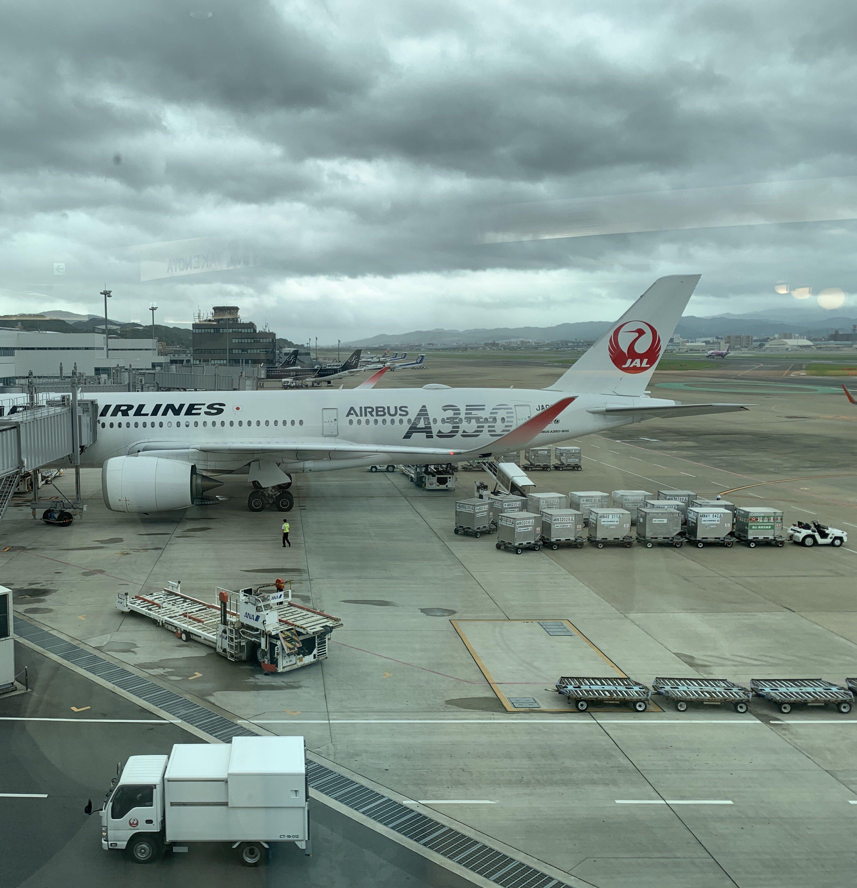
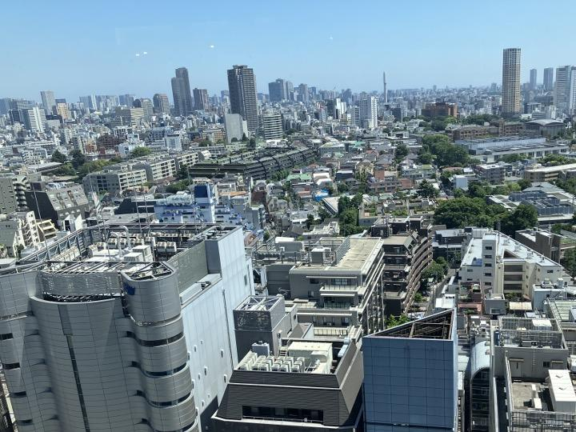
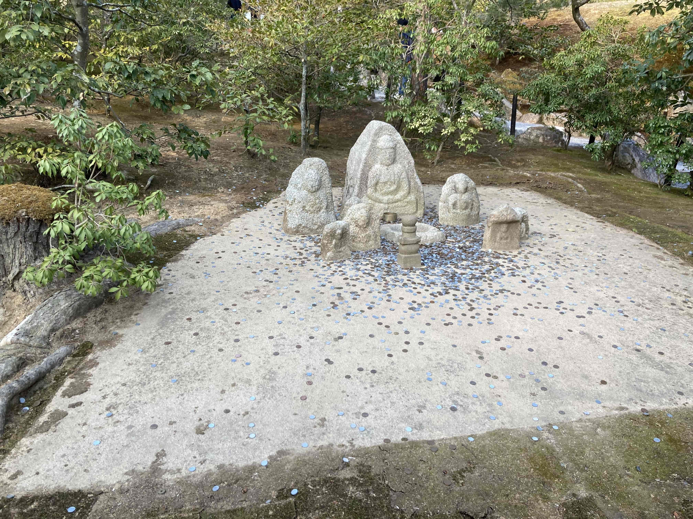
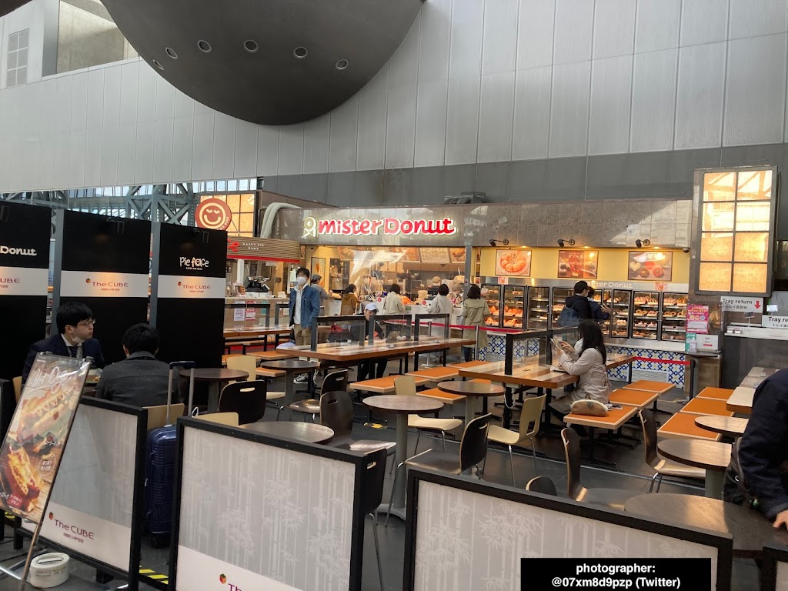
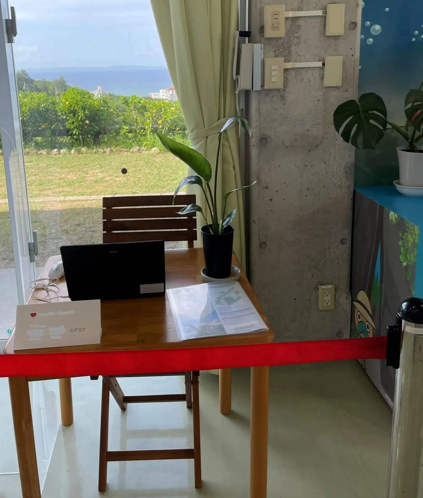

<!-- markdownlint-disable MD024 MD025 -->
TsukuCTF 2022にチーム"DCDC"として参加しました。TsukuCTF 2022のwriteupです。OSINTから10問、MISCから2問を提出しました。

<!--more-->

結果:

<blockquote class="twitter-tweet tw-align-center"><p lang="ja" dir="ltr">DCDCは先日開催されたTsukuCTFに参加し、3位の成績をおさめました！ <a href="https://t.co/3II4vxpK1f">pic.twitter.com/3II4vxpK1f</a></p>&mdash; DCDC (@dcdcnation) <a href="https://twitter.com/dcdcnation/status/1584701730532782080?ref_src=twsrc%5Etfw">October 25, 2022</a></blockquote> <script async src="https://platform.twitter.com/widgets.js" charset="utf-8"></script>


https://twitter.com/dcdcnation/status/1584701730532782080
解いた問題:  

<blockquote class="twitter-tweet tw-align-center"><p lang="zxx" dir="ltr"><a href="https://t.co/JAFUimw0Yn">pic.twitter.com/JAFUimw0Yn</a></p>&mdash; rand0m (@crypt_3n) <a href="https://twitter.com/crypt_3n/status/1584108376266772481?ref_src=twsrc%5Etfw">October 23, 2022</a></blockquote>

## Where (406, 98 Solves)

> 北海道に住んでいるつくしさんは東京旅行に行った際に高層ビルの窓から写真を撮りました。
>
> でも撮影した場所を忘れてしまったようです。この写真が撮影された場所について建物名を教えてあげてください。
>
> フラグはこの建物の開業日(`YYYY/MM/DD`)です。たとえば、東京スカイツリーの開業日は2012年5月22日なので、フラグは`TsukuCTF22{2012/05/22}`となります。

### 配布ファイル


### 解法

画像から場所が渋谷であることが分かる。Google Earthを用いて構図を再現してみると、撮影者がいた建物名が"渋谷パルコ"であることが特定できる。
実際に再現すると、次のようになる。

Flag: `TsukuCTF22{1973/06/14}`

## FlyMeToTheTsukushi (218, 169 Solves)

> つくし君は、はるばる飛行機で愛するパートナーのもとへやってきました。  
> ここはどこの空港かわかりますか？
>
> `この問題はフラグを10回までしか提出できません。`
> `※フラグの形式はTsukuCTF22{空港名}です。空港の名前だけを入力してください。(hoge空港の場合、hogeのみがフラグになります)`

### 配布ファイル



### 解法

画像をみると、TAKENOYAという文字列が見える。


[店舗一覧](https://www.umakamonya.com/shoplist)を調べると、空港に店を構えているのは一店舗しかない。

Flag: `TsukuCTF{福岡}`

### おまけ

撮影場所が3Fであることや、手前の滑走路の情報を手がかりにしながら構図を再現すると次のようになる。


## TakaiTakai (473, 53 Solves)

> 日本の町は美しい。撮影地を答えてください。
>
> フラグはこの建物の開業日(`YYYY/MM/DD`)です。たとえば、東京スカイツリーの開業日は2012年5月22日なので、フラグは`TsukuCTF22{2012/05/22}`となります。

### 配布ファイル



### 解法

**特徴**:

- 画質が悪い。
- タワーがある。
- 特徴的な建物がある。
- 右下の道がY字に分かれている可能性がある。


手がかりが他にないので、第六感に従い都心内の似たようなタワーをGoogle earth上で調べる。
なんと**偶然**、建物を発見する。


建物の名前が"渋谷ソラスタ"なので、あとは開業日を調べるだけ。

Flag: `TsukuCTF22{2019/03/29}`

## TsukuCTF Big Fan 1,2,3

**TsukuCTF Big Fan 1** (488, 36 Solves)):
> 彼はTsukuCTFの大ファンで、TsukuCTFのあらゆるコンテンツを確認しています。  
> 私は彼と一緒にTsukuCTFに参加しようと思っています。しかし、私は彼の実力をあまり知りません。  
> まずは彼のTwitterのアカウントを特定し、そのアカウントのアカウント作成日を求めてください。  
> フラグ形式は`TsukuCTF22{YYYY/MM/DD}`です。
>
> He is a big TsukuCTF fan and checks all the content of TsukuCTF.  
> I am planning to participate in the TsukuCTF with him. But I don't know much about his ability.  
> First, specify his Twitter account and ask for the date the account was created.  
> The flag format is `TsukuCTF22{YYYY/MM/DD}`.

**TsukuCTF Big Fan 2** (500, 6 Solves):
> 彼はWebサイトを運営しているようです。
>
> He appears to be running a web site.

**TsukuCTF Big Fan 3** (498, 18 Solves):
> When is his birthday? The flag format is TsukuCTF22{YYYY/MM/DD}.

### 配布ファイル


### 解法

[v1enetta](https://twitter.com/v1enetta/)さんがtwitterアカウントを特定してくれた（公式ツイッターアカウントのフォロワー欄から見つけたらしい）。

<https://twilog.org/SuperProStalker>

このアカウントは、このツイートに個人情報が含まれていると主張している。

[](https://web.archive.org/web/20220917230409/https://twitter.com/yJRXaCh4M5aRTk0/status/1571273659335184384)
Google Driveへのリンクがある。
<https://drive.google.com/drive/folders/1sal6kj0OrsO7Xu-gQZeBFjYOm-kAtuns>
この、Google Driveのリンク先には、csvファイルとテキストファイルがある。おそらく、これがbreachされたデータということなのだろう。

<blockquote class="twitter-tweet  tw-align-center"><p lang="ja" dir="ltr">私は最近Webページ作成に興味があります。綺麗なデザインだと思いませんか？？ <a href="https://t.co/vV7lSQN6hw">pic.twitter.com/vV7lSQN6hw</a></p>&mdash; 串田つよし (@SuperProStalker) <a href="https://twitter.com/SuperProStalker/status/1581681692242477059?ref_src=twsrc%5Etfw">October 16, 2022</a></blockquote>

さて、つよしのツイートから、`byu...@gmail.com`であることがわかり、`dummy.csv`を調べると、誕生日が分かる。

```tsv
田川 ヒロシ    41    1980/01/10    Male    A    byucraglar5r7nzx3np9@gmail.com    090-9040-2901    185-4532    株式会社TSHSU 
```

TsukuCTF Big Fan 3のflag: `TsukuCTF22{1980/01/10}`

あるWebページのドメインについて言及している。punycodeであることを示唆するツイートがある。
<blockquote class="twitter-tweet  tw-align-center"><p lang="ja" dir="ltr">xn、実に美しい響きです。<br>&quot;xn&quot; is truly a beautiful word.</p>&mdash; 串田つよし (@SuperProStalker) <a href="https://twitter.com/SuperProStalker/status/1582443953109884929?ref_src=twsrc%5Etfw">October 18, 2022</a></blockquote>

<blockquote class="twitter-tweet  tw-align-center"><p lang="ja" dir="ltr">Webサイトを作成しました。知らない人にアクセスされると困るので、暗号で伝えます。<br>Web site was created. We don&#39;t want strangers to access it, so we tell them in code.<br><br>ctf 073b6d com</p>&mdash; 串田つよし (@SuperProStalker) <a href="https://twitter.com/SuperProStalker/status/1571228640981192704?ref_src=twsrc%5Etfw">September 17, 2022</a></blockquote>

rickrollされながら、[サブドメインに関する証明書がないかを検索する](https://crt.sh/?q=xn--ctf-073b6d.com)と、出てきました。(First blood! :tada:)

TsukuCTF Big Fan 2のflag: `TsukuCTF22{wh47_15_4_pun1c0d3?}`

## Money (108, 199 Solves)

> どこ？
> フラグは写真が撮影された場所の郵便番号(ハイフンを除く)を入れて下さい。例えば撮影された場所が東京都庁の場合、郵便番号は163-8001なので`TsukuCTF22{1638001}`となります。

### 配布ファイル



### 解法

画像検索の結果、白蛇の塚らしい。
Flag: `TsukuCTF22{6038361}`

## Robot (490, 33 Solves)

> つくし君がロボット見学に訪れた施設はどこ？  
> フラグ形式は `TsukuCTF22{施設名}` となります。施設名の表記は、その施設の英語版ホームページの表記に従います。  

### 配布ファイル


### 解法

ググる。
Flag: `TsukuCTF22{South China University of Technology}`

## FlagDM (500, 7 Solves)

> 謎の人物からDMが届きました。よく見ると脅迫文ののようです。DMを送った人物を調査して、この人物が使用している他のWebサービスを見つけてください。
>
> 注1: この人物は複数のWebサービスを使用していますが、そのいずれかのプロフィールにフラグが埋め込まれています。
>
> 注2: 画像に含まれているURLはこちらです。
> `https://bit.ly/3Ekih5M`
>
> I received a DM from a mysterious person. Please investigate the person who sent the DM and find out what other web services this person uses.
>
> Note 1: This person uses multiple web services, but the flag is embedded in one of their profiles.
>
> Note 2: URL included in the image is here.
> `https://bit.ly/3Ekih5M`

### 配布ファイル


### 解法

`https://bit.ly/3Ekih5M`について
[urlscanの結果](https://urlscan.io/result/88a8362b-2e31-48e2-8c6e-725699551266/)を確認すると、[Google docs](https://docs.google.com/document/d/1y266JcI1E8piugLQDPaK7boSzAKykg4FepQZIOt4Phg/edit?usp=sharing)へとリダイレクトされることが分かる。

この、ドキュメントについて調べる。[xeuledoc](https://github.com/Malfrats/xeuledoc)を用いた。

```txt
Document ID : 1y266JcI1E8piugLQDPaK7boSzAKykg4FepQZIOt4Phg

[+] Creation date : 2022/10/03 12:18:33 (UTC)
[+] Last edit date : 2022/10/03 12:29:36 (UTC)

Public permissions :
- reader

[+] Owner found !

Name : my real name is secret
Email : mpju40nchoyba85@gmail.com
Google ID : 03458870179467391774
```

[pr0xy](https://twitter.com/drib__)さんがGoogle Mapsにレビューが投稿されていることを発見。

投稿された画像内の情報から、撮影者のTwitterアカウントが <https://twitter.com/07xm8d9pzp> であることが紐付けられる。

ここから、YouTubeアカウントが紐付けられる。 <https://www.youtube.com/channel/UCZ7_GtoaC4oHCKBLhJi13Ww>

いずれも、`gross_poem`というアカウント名を使用している。
このアカウント名を他のサービスでも使っていないか調べると、 <https://trakt.tv/users/gross_poem>が存在する。
ページには、`TmljZSEgRmxhZyBpcyBIZXJlISAtPiBUc3VrdUNURjIye000bnlfMFMxTjdfNzAwbHNfM3gxNTd9Cg==`とあり、decodeすると、

```txt
Nice! Flag is Here! -> `TsukuCTF22{M4ny_0S1N7_700ls_3x157}`
```

となる。

Flag: `TsukuCTF22{M4ny_0S1N7_700ls_3x157}`

## Desk (454, 69 Solves)

> つくし君の大好きなお姉さんのデスクを見学させてもらったよ。
> さて、このデスクはどこにあるのだろうか?  
> フラグ形式は写真が撮影された場所の郵便番号(ハイフンを除く)を入れて下さい。例えば撮影された場所が東京都庁の場合、郵便番号は163-8001なので `TsukuCTF22{1638001}` となります。

### 配布ファイル



### 解法

画像の雰囲気から沖縄を感じる（コンクリート製の建物、海など）。実際、机の上には沖縄の地図がある。

[v1enetta](https://twitter.com/v1enetta/)さんが右のキャラクターが南城市のキャラクター「なんじぃ」であることを特定する。
ここで、Google earthを取り出し、南城市を探索すると、それっぽい建物を発見。


建物の角度と、画像内の庭の様子と衛星写真の比較から、南城市地域物産館の近くの店であると推測。

Flag: `TsukuCTF22{9011511}`

## Ochakumi (500, 3 Solves)

> 私はハッカーフォーラムである人に出会いました。彼はOSSエンジニアを名乗っており、このWebサイトを運営しているようです。
>
> ⚠️このWebサービスの応答はネットワークの性質上少し時間がかかりますが、数回程度のアクセスで十分に解くことができます。もし応答がない場合はAdminへ報告し、しばらくしてから再度アクセスしてください。
>
> `http://tsuku22qotvyqz5kbygsmxvijjg7jg2d7rgc42qhaqt3ryj66lntrmid.onion`

### 解法

Files:

- `Tsukunion.html`
- [`wasm_exec.js`](<https://github.com/golang/go/blob/master/misc/wasm/wasm_exec.js>)
- `main.wasm`

`main.wasm`を解析しようとするが、難易度が高い上にゴールが分からない。  
`strings main.wasm`の結果を見てみると

```txt
...
go1.18.4
/usr/local/go
path
github.com/GaOACafa/website
github.com/GaOACafa/website
(devel)
build
-compiler=gc
build
CGO_ENABLED=0
build
...
```

怪しいリポジトリに関する文字列がある。 <https://github.com/GaOACafa/website>

このリポジトリを確認すると、`.gitignore`に怪しい文字列がある。

[`.gitignore`](https://github.com/GaOACafa/website/blob/master/.gitignore)

```txt
deploy.sh
dist
node_modules
public/main.wasm
public/this_is_flag_dbKIMLQnMCI2fp0.html
public/favicon.ico
public/wasm_exec.js
index.html
```

`this_is_flag_dbKIMLQnMCI2fp0.html`が怪しそう。

アクセスするとflagが得られた。:tada:
[](http://tsuku22qotvyqz5kbygsmxvijjg7jg2d7rgc42qhaqt3ryj66lntrmid.onion/this_is_flag_dbKIMLQnMCI2fp0.html)

flag: `TsukuCTF22{C0uld_w45m_h4v6_p6r50n4l_1nf0rm4710n?}`

## Flash (500, 26 Solves)

> つくし君からマイコンボードを借りたら、このマイコンを使って実験を行ったホテルと部屋番号がわかってしまった！！
> マイコンのフラッシュメモリから読みだしたデータを渡すので、ホテル名と部屋番号を特定してください。
> `※フラグの形式はTsukuCTF22{XXホテル&XXXXXXXXXXXX_部屋番号}です。`

### 配布ファイル

### 解法

`strings`で`Flash.bin`を確認する。


SSIDっぽい文字列`apa-316-2428`がある。

ここでSSIDからホテル名を特定しようとしたが、普段使うサイトから `429 Too Many Requests` が返ってきてしまった。:lmao:  
続きは[pr0xyさんが詳しく解説している](https://pr0xy.hatenablog.com/entry/2022/10/23/220146#OSINT-Flash)。

## Lucky Number 777 (497, 19 Solves)

```python
import string

def challenge(lucky_number: str):
    flag = "TsukuCTF22{THIS_IS_NOT_FLAG}"  # TOP SECRET
    printable = string.printable
    filter = "_[].,*+%: 　|()#\\\t\r\v\f\n"  # (￣ー￣)

    if not all(c in printable for c in lucky_number):
        return "No Hack!!!"

    if any(c in filter for c in lucky_number):
        return "No Hack!!!"

    if lucky_number == "flag" or "{flag}" in lucky_number:
        return "No Hack!!!"

    try:
        return "your lucky_number is " + str(eval(lucky_number))
    except:
        return "No Hack!!!"
```

cf.
<blockquote class="twitter-tweet  tw-align-center"><p lang="ja" dir="ltr">便利format string <a href="https://t.co/tzXSf7C9jb">pic.twitter.com/tzXSf7C9jb</a></p>&mdash; rand0m (@crypt_3n) <a href="https://twitter.com/crypt_3n/status/1542714591800479744?ref_src=twsrc%5Etfw">July 1, 2022</a></blockquote>

`f"{flag=}"`で、チェックをバイパスしてflagが手に入る。(なお、提出したflagをメモしていない)

## soder (498, 16 Solves)

regexの処理にかかる時間を測定して、flagを得ることができそうだなと思う。[pr0xy](https://twitter.com/drib__)さんにReDosという概念を教えてもらい、それを利用して解くことができた。

参考: <https://diary.shift-js.info/blind-regular-expression-injection/>

Flag: `TsukuCTF22{4_w47ch3d_p07_n3v3r_b01l5}`

# いかがでしたか?

- OSINTの問題を軸にするCTFコンテストは少ないので、新鮮でした。面白かったです(特に、"TsukuCTF Big Fan"、"FlagDM")
- 自分が解いた問題について、再現画像を全て作成しました。:)
