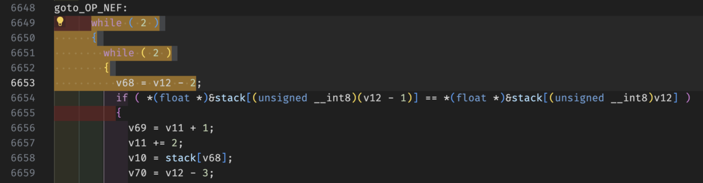

# Gaming VM

> title: Gaming VM
description: VM reversing for beginners :)
author: ptr-yudai
>
>
> Files:
>
> - q3vm
> - flag.qvm

---

### 初見

実行すると、フラグチェッカー(入力文字列がflagかどうか教えてくれる)型の問題であることがわかる。

IDAで開くとstack based VMっぽいことがわかる。



while (2) * 2があり、これは何? となる

q3vmについて調べると、<https://github.com/jnz/q3vm> が見つかる。disassemblerがないか調べると、<https://github.com/brugal/q3vm> が見つかる。

ここで配布バイナリ (q3vm) とGitHubのコードからビルドしたバイナリを比較する。


diffが存在し、問題バイナリにおいてsystem callが拡張されていることがわかる。

<!-- two column  -->
<!-- <div class="row">
<div class="column">
    
</div>
<div class="column">
    
</div>
</div> -->


この結果に基づいて、disassemblerの`*_syscall.asm`の該当箇所を更新する。

### 静的解析

Disassemblerの結果をぐっと見ると、線形合同法という言葉が浮かび上がってくる (rand関数内の定数などを調べる)。入力を7とXORした結果を使って入力を処理しているようだが、復号しようとしてもなかなか復号できなかった。

### 動的解析

VMの処理を追おうとしたがCFGを見て得策でないと判断した。やり方はありそうだが、短時間でやりたくなかった。


### Guessing

フラグに含まれる文字が既知であることと、フラグがleetを含む英文であることを用いて、フラグをguessしようとした。しかし、複雑すぎてダメだった (Guess力が足りないとも言う)。

```cpp
    abcdefghijklmnopqrstuvwxyz: A-Z
013_a   ef  i klmn pqrstuvw   : 持っている文字
```

### Solution

q3vmのコードを読むと`DEBUG_VM`や`vm_debugLevel`などの変数が存在することに気づく。ここで、そもそもランタイムをソースコードレベルで改変できることに気づく。`goto_OP_EQ`で比較を記録して、評価を適当に変えてやれば良い。

```cpp
if (r0 != 1 && r1 != 1) {
  fprintf(stderr, "OP_EQ: %c -> %c\n", r1 ^ 7, r0 ^ 7);
}
```

出てきた🎂 GG

Flag: `CakeCTF{A_s1mpl3_VM_wr1tt3n_f0r_Quake_III}`

### お気持ち振り返り

- もっと早く解けるようになりたい

---

## 終わりに

様々な方面から解析すると徐々に答えが分かっていく過程が楽しめました! 🎂
