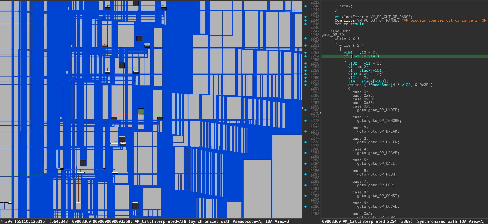

# Gaming VM (14 solves, 239 points)

> title: Gaming VM  
> description: VM reversing for beginners :)  
> author: ptr-yudai
>
> Files:
>
> - [q3vm](https://github.com/sajjadium/ctf-archives/blob/main/ctfs/CakeCTF/2023/rev/Gaming_VM/q3vm)
> - [flag.qvm](https://github.com/sajjadium/ctf-archives/blob/main/ctfs/CakeCTF/2023/rev/Gaming_VM/flag.qvm)

追記:
チーム[BunkyoWesterns](https://ctftime.org/team/269765)で参加し3位だった。AVTOKYOから0時に帰ってきた時にはrevはこれしか残っていなかったので1問だけ解いた :cake:。楽しかった！

---

### 初見

実行すると、フラグチェッカー(入力文字列がflagかどうか教えてくれる)型の問題であることがわかる。

IDAで開くとstack based VMっぽいことがわかる。

 * 2があり、これは何? となる")

q3vmについて調べると、<https://github.com/jnz/q3vm> が見つかる。disassemblerがないか調べると、<https://github.com/brugal/q3vm> が見つかる。

ここで配布バイナリ (q3vm) とGitHubのコードからビルドしたバイナリを比較する。


diffが存在し、問題バイナリにおいてsystem callが拡張されていることがわかる。

<div style="display: flex; justify-content: space-between;">

<div style="width: 49%;">


</div>
<div style="width: 49%;">


</div>
</div>

この結果に基づいて、disassemblerの`*_syscall.asm`の該当箇所を更新する。

### 静的解析

Disassemblerの結果をぐっと見ると、線形合同法という言葉が浮かび上がってくる (rand関数内の定数などを調べる)。入力を7とXORした結果を使って入力を処理しているようだが、復号しようとしてもなかなか復号できなかった。

### 動的解析

VMの処理を追おうとしたがCFGを見て得策でないと判断した。やり方はありそうだが、短時間でやりたくなかった。


### Guessing

フラグに含まれる文字が既知であることと、フラグがleetを含む英文であることを用いて、フラグをguessしようとした。しかし、複雑すぎてダメだった (Guess力が足りないとも言う)。

```txt
    abcdefghijklmnopqrstuvwxyz: a-z
013_a   ef  i klmn pqrstuvw   : 持っている文字
```

### Solution

q3vmのコードを読むと`DEBUG_VM`や`vm_debugLevel`などの変数が存在することに気づく。ここで、そもそもランタイムをソースコードレベルで改変できることに気づく。`goto_OP_EQ`で比較を記録して、評価を適当に変えてやれば良い。

```cpp
if (r0 != 1 && r1 != 1) {
  fprintf(stderr, "OP_EQ: %c -> %c\n", r1 ^ 7, r0 ^ 7);
}
```

出てきた🎂 GG

Flag: `CakeCTF{A_s1mpl3_VM_wr1tt3n_f0r_Quake_III}`

### お気持ち振り返り

- もっと早く解けるようになりたい

### 追加: 振り返り

- <https://blog.akiym.com/entry/2023/11/12/200742#Gaming-VM>
  - > とりあえずgdbで動かしながら適当なVMの命令に相当するところでbreakしつつ値を見てみるのを試していたところ、goto_OP_EQでほぼflagの比較がされていそうなことに気づきました。ブルートフォースするスクリプトを書きつつ、途中で調整が必要なところは面倒になってgdbを動かしつつ手で求めました。
  - CFGが複雑に見えるがsimilarityが高いことからそこまで身構えなくても良く、gdbでログを取ればいける。なるほど。

#### 色々なCFGを見てみる

気になったので、色々なツールでCFGを生成してみる。

- IDA
    
- Binary Ninja
    
- angr
    <div style="display: flex; justify-content: space-between;">

    <div style="width: 49%;">

    

    </div>
    <div style="width: 49%;">

    

    </div>
    </div>

- Ghidra
    <div style="width: 50%;">

    。設定でリミットを変更する、もしくは、手動で修正すれば解決できるかもしれない。面倒なので試していない。")

    </div>

---

## 終わりに

様々な方面から解析すると徐々に答えが分かっていく過程が楽しめました! 🎂
